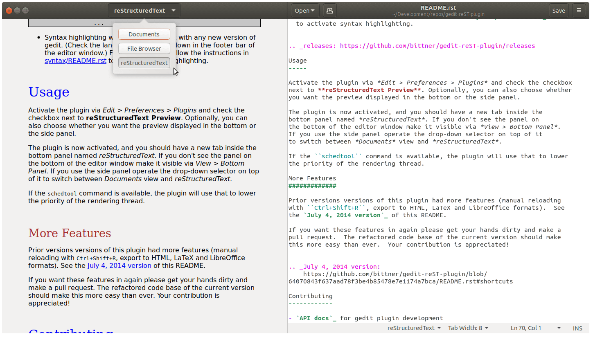
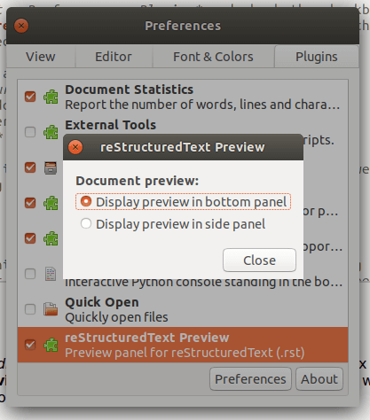
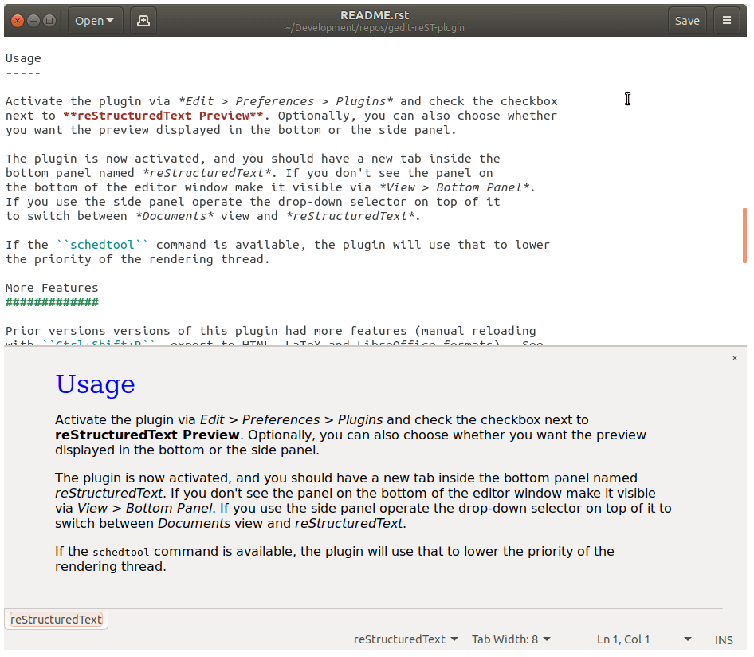

reStructuredText Plugin
=======================

A plugin for GNOME's text editor `gedit`_ to render `reStructuredText`_.

Layout Options
--------------

.. _gedit: https://wiki.gnome.org/Apps/Gedit
.. _reStructuredText: https://www.sphinx-doc.org/en/master/usage/restructuredtext/basics.html

Dependencies
------------

- `Python`_: version >= 3.3 (-> use `mcepl/reStPlugin`_ for Python 2.x)
- `Docutils`_ and `Pygments`_: ``sudo apt install python3-docutils``
- (optional) schedtool: ``sudo apt install schedtool``

.. _Python: http://www.python.org/
.. _mcepl/reStPlugin: https://github.com/mcepl/reStPlugin
.. _Docutils: http://docutils.sourceforge.net/
.. _Pygments: http://pygments.org/

Installation
------------

- Choose the right source for your version of gedit from the releases_ on
  GitHub.  With ``git`` you can checkout the corresponding tag (e.g.
  ``git checkout gedit-3.8``).

  :gedit-3.8: 3.8 <= gedit < to 3.10
  :gedit-3.10: gedit >= 3.10 (*3.18 has been reported to work fine*)
  :gedit-3.22: gedit >= 3.22 (*3.22.1 verified on Ubuntu 17.10*)
  :gedit-3.28: gedit >= 3.28 (*3.28.1 verified on Ubuntu 18.04*)

- Put ``reST.plugin`` file in gedit's plugins directory.  The standard one
  should be ``~/.local/share/gedit/plugins/``.  Alternatively, the global
  directory is something like ``/usr/lib/gedit/plugins/`` or
  ``/usr/lib/<architecture>-linux-gnu/gedit/plugins/``.

- Copy the whole ``reST`` folder into the same directory.

You should then obtain something like this::

    .../plugins/
            reST.plugin
            reST/
                schemas/
                  gschemas.compiled
                  org.gnome.gedit.plug...
                __init__.py
                config.py
                restructuredtext.py
                ...

- Syntax highlighting works out-of-the-box with any new version of gedit.
  (Check the language mode drop-down in the footer bar of the editor window.)
  For older versions follow the instructions in `<syntax/README.rst>`_
  to activate syntax highlighting.

.. _releases: https://github.com/bittner/gedit-reST-plugin/releases

Usage
-----

Activate the plugin via *Edit > Preferences > Plugins* and check the checkbox
next to **reStructuredText Preview**. Optionally, you can also choose whether
you want the preview displayed in the bottom or the side panel.

The plugin is now activated, and you should have a new tab inside the
bottom panel named *reStructuredText*. If you don't see the panel on
the bottom of the editor window make it visible via *View > Bottom Panel*.
If you use the side panel operate the drop-down selector on top of it
to switch between *Documents* view and *reStructuredText*.

If the ``schedtool`` command is available, the plugin will use that to lower
the priority of the rendering thread.

More Features
#############

Prior versions versions of this plugin had more features (manual reloading
with ``Ctrl+Shift+R``, export to HTML, LaTeX and LibreOffice formats).  See
the `July 4, 2014 version`_ of this README.

If you want these features in again please get your hands dirty and make a
pull request.  The refactored code base of the current version should make
this more easy than ever.  Your contribution is appreciated!

.. _July 4, 2014 version:
    https://github.com/bittner/gedit-reST-plugin/blob/6407084/README.rst#shortcuts

Contributing
------------

Please run ``flake8`` and, optionally, ``pylint`` to ensure your contribution
adheres to our coding style.

Please compile the `GSettings`_ schema if you make schema changes: (`DTD`_)

.. code-block:: console

    glib-compile-schemas reST/schemas/

**Resources:**

- `API docs`_ for gedit plugin development
- `GNOME discussion forum`_ for a helpful crowd

.. _GSettings: https://developer.gnome.org/gio/stable/GSettings.html#GSettings.description
.. _DTD: https://gitlab.gnome.org/GNOME/glib/-/blob/master/gio/gschema.dtd
.. _API docs: https://wiki.gnome.org/Apps/Gedit/PythonPluginHowTo#api-gedit-panel
.. _GNOME discussion forum: https://discourse.gnome.org/

Alternatives
------------

If you're not totally happy with this plugin try the following editors for
quick and free solutions of editing reStructuredText files:

- rsted_ (online reStructuredText editor)
- ReText_ (reStructuredText and MarkDown editor)

.. _rsted: http://rst.ninjs.org/
.. _ReText: https://github.com/retext-project/retext
